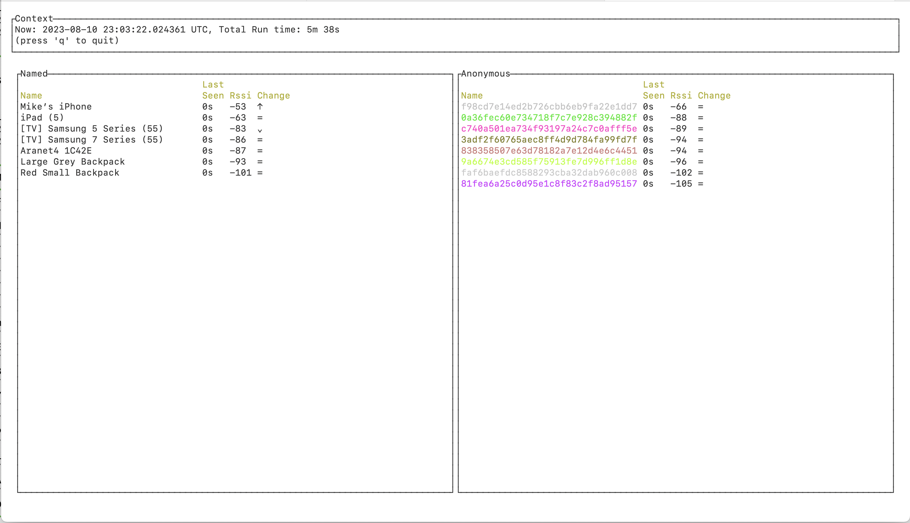

# blescan (Bluetooth Low Energy Scanner)

I was playing about with a [different project](https://github.com/mikemoraned/aranet4) that uses BLE. I noticed that I was seeing some devices being discovered that I wasn't explictly searching for. So, I was curious what you could passively find out about the devices around you.

Hence, this small project.

There are other projects that look nicer, but I was interested in what I could put together myself with the API's that are available, in the style of a Terminal UI.

## How to use

I've only used it on a Mac, so it may not work as follows on other platforms. The underlying libraries it uses should work on other platforms, so it should compile and run. However, _I have not tested those other platforms_.

It's fairly simple to use:

    cargo run

(The first time you run this on a Mac in a Terminal it will ask for permissions to use Bluetooth)

This will then bring up a simple text UI which shows the named devices that have been discovered. It also shows 'anonymous' devices, where the name is derived from a hash of the "manufacturer data" that is in the BLE advertisement.

Each device is shown with:

- how long ago it was last seen
- the RSSI (Received Signal Strength Indicator)
- a change indicator:

  - '↑' = stronger
  - '=' = same strength
  - '⌄' = weaker
  - '\*' = newly-discovered (so nothing to compare to)

Scans update every second, and are always sorted by age (newest-first) then by RSSI strength (strongest-first).
Anonymous devices are colored arbitrarily, but consistently, to help identify them as they move in the list.

### Options

To see all options, do:

    cargo run -- -h

To record all discovery events to file, do:

    cargo run -- --record prefix.jsonl

(the file prefix can be anything you want but must end with `.jsonl`)

This will save all discovery events (what signatures are seen, when, and with what rssi) to a new file, in [jsonl format](https://jsonlines.org).
